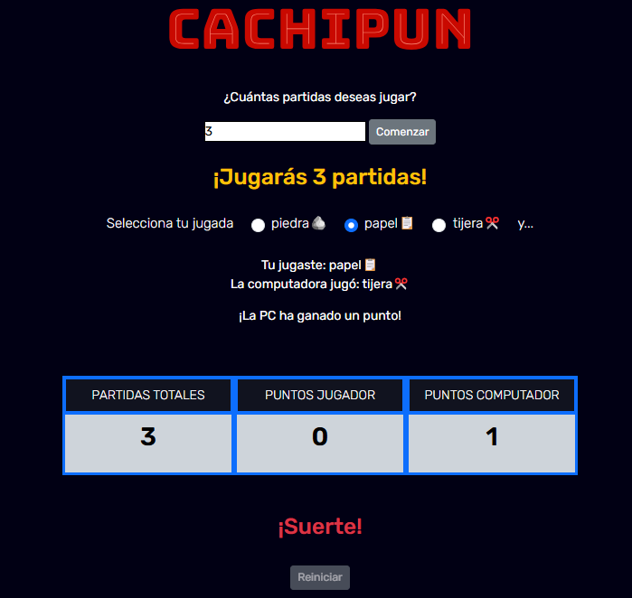

# **ROCK, PAPER, SCISSORS GAME**

## **Description**
This page allows the user to play the traditional game of Rock, Paper, Scissors against the machine. The user can specify how many rounds they want to play, select their move each turn, and the machine generates its move randomly using `Math.random()`. At the end of each round, the winner is determined based on the rules of the game, and the result (winner, loser, or tie) is displayed.

## **Technologies Used**
HTML5, CSS3, JavaScript

## **Features**
- **Round selection**: The user specifies how many rounds they want to play against the machine.
- **Move selection**: The user chooses between "Rock," "Paper," or "Scissors."
- **Automated move generation**: The machine generates its move randomly using the `Math.random()` function, assigning random numbers to moves.
- **Winner determination**: The program compares the user’s move and the machine’s move to decide the winner according to the game rules.
- **Immediate results**: Displays the result of each round instantly (winner, loser, or tie).
- **Personalized messages**: Congratulates the user if they win, declares a tie, or informs the user about the machine’s victory.

## **Screenshots**
<p align="center">
  
</p>

## **Installation**
1. Clone the repository:
   ```bash
   git clone https://github.com/yadicep/game_rock_paper_scissors.git
